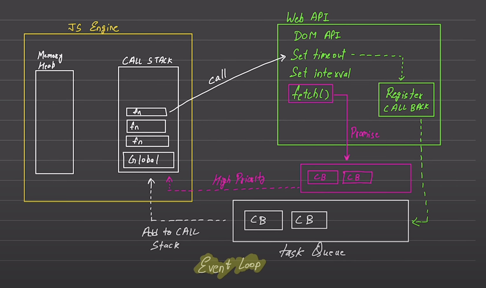
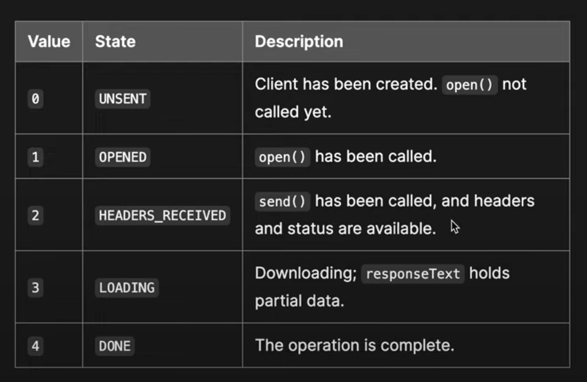
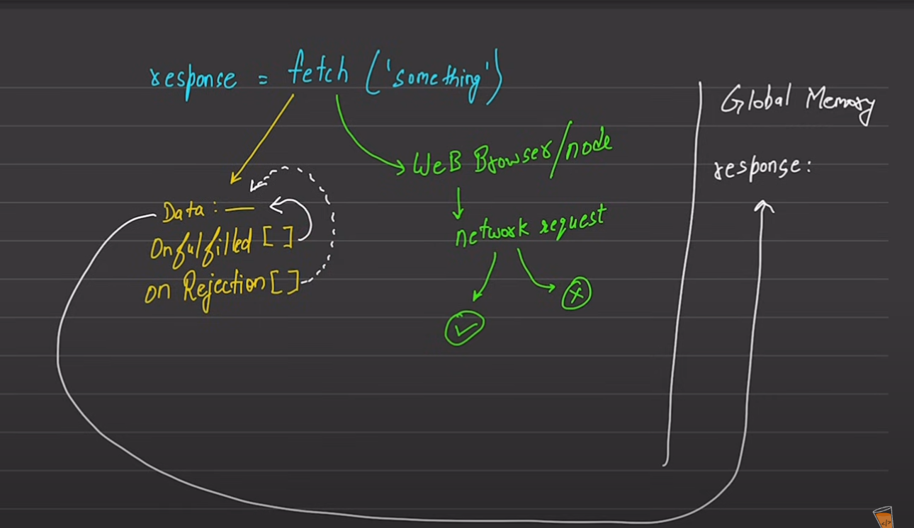

# Javascript

### const, let and var

1. Variables declared as `const` cannot be reassigned a new value. It means you cannot assign a new value to the const variable.
2. `let` vs `var`
   1. Variables declared with `var` have a scope through out the file. It means if a variable is declared with `var` in a file, will be available throughout the file. It means even if the variable is declared inside any loop, any conditional statement or any scope `{}`, its value can be accessed throughout the file. Even after its scope should be over. Variables defined using `var` have **Global Scope**
   2. Variables declared with `let` are properly scoped. They can be used only with the scope [`{}`] they are declared. They have **Block scope**.
3. We can also define a variable without using any var, let or const. But this way of declaring variable should not be used.
4. All the variables have default `undefined` value if not initialized or defined but declared.

### Scopes in js

1. There are 3 types of scopes in JS after the ES6 implementation:
   1. **Block Scope**
      1. Variables declared inside a `{ }` block cannot be accessed from outside the block.
      2. This is not applicable for variables declared using `var` inside a block.
   2. **Function Scope**
      1. Variables declared within a JavaScript function, are LOCAL to the function
      2. Local variables have Function Scope. They can only be accessed from within the function.
   3. **Global Scope**
      1. Global variables can be accessed from anywhere in a JavaScript program
      2. Variables declared with `var`, `let` and `const` are quite similar when declared outside a block.
2. Before ES6 implementation, JS only has Function and Global scope.

### use strict

1. In your js file, at the very top, if you write `"use strict"` it directs the interpreter to consider all the code inside JS file as newer version.
2. JS has multiple versions which newly added features so thats why the "use strict" if used to direct the interpretor to consider the code in the file as newer version.
3. Currently, mostly all the newly written code is by default considered as newer version.

### ECMA script

1. When JS was in initial days, then all the browsers have their own standards of writing the JS code.
2. ECMA scripts organization is created to standardize the JS syntax standards.

### null vs undefined

1. `undefined` is when you have declared a variable but didnot defined it. **typeof undefined => undefined**
2. `null` is a standalone value. It represents an empty value. This can be assigned to variables. It signifies that ideally a values should be there in the variable but due to some error/issue the variable's actual values can't be fetched so the value is `null`. **typeof null => object**

### Conversions

1. See the following conversions from any data type to `number`

   ```javascript
   let value = "33";
   // "33" => 33
   // "33abc" => NaN
   //  true => 1; false => 0
   //  undefined => NaN
   //  null => 0
   console.log(Number(value)); //33
   ```

2. See the following conversions from any data type to `boolean`

   ```javascript
   // 1,2,3.... => true; 0 => false
   // "" => false
   // "hitesh" => true
   ```

3. See the following conversions from any data type to `string`
   ```javascript
   // 33 => "33"
   // true => "true", false => "false"
   // undefined => "undefined"
   // null => "null"
   ```

### Comparisons

1. Check the following comparisons

   ```javascript
   console.log(null > 0); //false
   console.log(null == 0); //false
   console.log(null >= 0); //true
   ```

   - The comparison operators (>,<,<=..) work differently than equality operators (==,===). The comparison operators convert null to a number thus treating it as 0. Hence, `null >= 0` is true

2. For comparisons to happen expectedly, try to keep the data types of the values on both side same. Otherwise, the actual results may vary from the expected ones.

### `===` vs `==`

1. `===` performs a strict check on the values means it check for the equality of the values as well as their data types. Basically, this does not perform any conversion in the expression.
   1. `5===5` => `true`
   2. `"5"==5` => `false`
2. `==` performs a check on the values after the conversions in the expression.
   1. `5==5` => `true`
   2. `"5"==5` => `true`

### Data Types

1. In JS we have 2 types of data types broadly. This categorization is done on the basis of how data is stored in memory.
   1. Primitive
   2. Non Primitive
2. Primitive Types:
   - These are like call by value.
   - Whenever you retrive their values, the copy of the value is returned and changes are made into the copied values and finally the new value is reassigned to the variable. It can result in reassigning the memory address to the variable for the new value.
   - Types:
     1. String
     2. Number
     3. Boolean
     4. null (Empty)
     5. undefined
     6. Symbol
     7. BigInt (For large numberic values)
3. Non Primitive (Reference Types)
   - These are also referred to as Reference Types
   - Whenever you try to assess the values, then the reference of the values is returned and the changes made in the values are made in the actual values.
   - Non primitive data types generally have type as object.
   - Types
     1. Arrays // object
     2. Objects // object
     3. Functions // function object

### Stack and Heap memories

1. Primitive types use **stack** memory and Non-primitive types use **heap** memory.
2. Stack memory returns the copy of the values assigned to a variable. Heap memory returns the reference of the original value.

### String Interpolation in JS

1. We can use `` to inject variables in strings. This is mostly used in modern days to concatinate different variables as string.
2. Example
   ```javascript
   const name = "AH";
   console.log(`Hello!! ${name}`); // Hello!! AH
   ```

### String

1. You can define string in the following ways:
   1. `const s1 = "Hello"`
   2. `const s2 = new String("Hello")`

### Math.random

1. For getting the random values between min and max, follow the following formula
   `Math.floor(Math.random() * (max - min + 1)) + min`

### Arrays

1. Arrays can contain multiple types of elements in it at the same time.
   1. For example: `const arr = [1,2,true,"AH"]`
2. Javascript arrays are resizable.
3. JS array copy operations creates **shallow copies**.

   1. It means in the following code, both arr1 and arr2 are pointing to the same array reference.

   ```javascript
   const arr1 = [1, 2, 3, 4];
   const arr2 = arr1; //Shallow copy. Both arr1 and arr2 are pointing to the same array reference
   arr2[2] = 5;
   console.log(arr1[2]); // 5
   ```

4. Spread operator (...) is used to spread all the elements of an array.
   ```javascript
   const arr1 = [1, 2, 3];
   console.log(...arr1); // 1 2 3
   ```

### Objects

1. We can declare objects in 2 ways:
   1. Literals ( `const obj = {}` )
   2. Constructors ( `const obj = Object.create()` or `const obj = new Object()` )
2. Singleton object is created in case when created using constructors while literals donot create any singleton object.
3. Objects are made up of key value pairs. All the keys are by default considered as string type.
4. We can access values in objects in 2 ways:
   1. `obj.<keyname>`
   2. `obj["<keyname>"]`
5. We can freeze any object so nobody can change it. If anybody tries to change it, the changes will not be propogated to the object.
   1. `Object.freeze(<object>)`
6. We can add any function as value to a key in objects. If you want to access any key inside the function inside an object, you need to use `this`.
   1. Note: If you want to use `this` in a function inside an object, make sure the function is not an arrow function because **arrow functions dont have the access to `this`**
7. We can destruture keys and values from an object

   ```javascript
   const obj = {
     name: "AH",
     age: 25,
     isLoggedIn: true,
     sessions: ["session1", "session2"],
   };

   const { name, age, sessions: sessionIds } = obj;
   console.log(name); // AH
   console.log(age); // 25
   console.log(sessionIds); // [ 'session1', 'session2' ]
   ```

### Functions

1. Function Parameters are defined at the time of function definition.
2. Function Arguments are values that are passed to the function at the time of calling.
3. ```javascript
   function greet(name, age = 25) {
     console.log(`Hello! Mr.${name} of age ${age}`);
   }
   greet("AH", 26); // Hello! Mr.AH of age 26
   greet(); // Hello! Mr.undefined of age 25
   //Default values is taken in the above case when no argument is passed
   ```
4. We have multiple methods of declaring and defining functions

   1. Normal function declaration

      ```javascript
      function func1() {
        // functionality
      }
      ```

   2. Expression function declaration

      ```javascript
      const func1 = function () {
        // functionality
      };
      ```

   3. Arrow function declaration

      ```javascript
      const func1 = () => {
        // functionality
      };
      ```

### this

1. `this` refers to the context (variables and their values) of the scope where it is being currently used.
   ```javascript
   const userdata = {
     username: "AH",
     age: 29,
     greet: function () {
       console.log(`Hello!! ${this.username}`); // Here we can access any key inside the object using this keyword.
     },
   };
   // In the above case, the current context for this is the keys inside the scope of the object userdata.
   ```
2. In node env, the `this` will refer to empty object/context.
   ```javascript
   console.log(this); // {}
   ```
3. In browser, the `this` will refer to window object. In browser, we have window object as the Global object. This window object helps in capturing the all the events occuring on window.
   ```javascript
   // In browser console
   console.log(this); // Window {window: Window,...}
   ```
4. Arrow functions dont have access to this, thus they dont have access to current context.

   ```javascript
   const obj = {
     key1: "value1",
     key2: "value2",

     func1: function () {
       console.log(this); // {key1: 'value1', key2: 'value2', func1: [Function: func1], func2: [Function: func2]}
       console.log(this.key1); // value1
       console.log(this.key2); // value2
     },
     func2: () => {
       //arrow function
       //Arrow functions dont have access to this, thus they cant access the current context.
       console.log(this); // {}
       console.log(this.key1); // undefined
       console.log(this.key2); // undefined
     },
   };

   obj.func1();
   obj.func2();
   ```

### Arrow functions Syntax

1. Normal with return

   ```javascript
   const func = (value1, value2) => {
     return value1 + value2;
   };
   ```

2. Implicit return, this is written in one line and the expression is returned by default

   ```javascript
   const func = (value1, value2) => value1 + value2;
   ```

### IIFE (Immediately Invoked Function Expression)

1. This is used to immediately invoke function call after the definition
2. Syntax:

   ```javascript
   (function one() {
     console.log("DB Connected");
   })(); //Here we are immediately invoking the function after the definition.
   ```

3. Note: The semicolon(;) at the end of IIFE is must as the IIFE itself don't know where to end the context. Thus if you omit the `;` and if you try to invoke another IIFE then it will start throwing error.
4. Usecase:
   1. Sometimes the global scope has a lot of pollution in it, so to avoid the global scope pollution, we ran the IIFE

### Javascript code execution and call stack

1. Javascript Execution Context
   1. The way in which Javascript executes your code.  
      
2. Whenever our code is submitted to JS, a Global Execution Context is formed. This global execution context is refered by `this` variable. The Global Execution context is based on the environment in which the code is executed. It will different for Browser env, Nodejs env etc. In browser, the Global EC or `this` points to the `window` object.
3. Note: Javascript is a single threaded language.
4. There are 2 types of execution contexts
   1. Global Execution Context
   2. Function Execution Context
   3. Eval Execution Context
5. Javascript code execution

   1. The code execution takes place in 2 phases:
      1. Memory Creation phase (The memory for all the variables, functions etc is allocated in this phase)
      2. Execution Phase
   2. Consider the following code:

      ```javascript
      let val1 = 10
      let val2 = 5
      function addNum( value1, value2 ){
      let total = value1 + value 2
      return total
      }

      let result1 = addNum( val1, val2 )
      let result2 = addNum( 10, 2)
      ```

      1. For the above code execution, first Global EC (aka Global Environment) is allocated to `this`.
      2. Then we have the Memory Creation Phase. Here the variables are allocated memory without putting the actual values in them. For example, the memory space for val1 and val2 will be allocated with undefined as the value in them. The functions are also assigned memory address with their definition in them.  
         
      3. Then, we have the Execution phase:  
         
         1. Here, first the variables will be assigned the actual values to them.
         2. Then, it dont have to do anything with the function definition of addNum()
         3. Then, we have the variable result1, whose value is derived from addNum(val1,val2) call. Thus, this function call will have its own execution context. This new execution context will have its own variable env and execution thread. It means the new execution context will have its own memory creation phase and execution phase. After the computation happened in the execution context for total ( val1 + val2 ), the total value is returned to the Global EC.
         4. Same thing will happen for result2.

6. Call Stacks
   1. It is the stack maintained for function calls.
   2. Once the code comes for execution at first, the Global Execution context is pushed to the call stack.  
      
   3. Then, if we have function call in the code, then the function reference is pushed to the stack. Say func1() comes for the execution.  
      
   4. Once the execution of the function at the stack top is completed, it is popped from the stack  
      
   5. Same thing happens when we have nested function. The functions are pushed to the call stack based on the order they are called and are popped out of call stack in LIFO (Last In First Out Manner).

### Falsy values

1. Falsy values are values that are considered `false` if put in a condition
2. We have the following falsy values in JS:
   1. false
   2. 0
   3. -0
   4. 0n (BigInt)
   5. ""
   6. null
   7. undefined
   8. NaN
3. All the other values except the above values are considered truthy values.
4. Even `[]` and `{}` and Empty function (`function(){}`) are considered truthy values

   ```javascript
   const arr = [];
   if (arr) {
     console.log("Inside if");
   }
   // Output --> Inside if, as [] is a truthy value even though the array is empty.
   ```

5. For an array, we need to check by its length if its empty or not, `arr.length === 0`.
6. For objects, we can check by its keys length, `Object.keys(<object name>).length === 0`

### Nullish Coalescing Operator (??)

1. This only works with `undefined` and `null`.
2. This operator does a safety check for `undefined` and `null` before assigning value to the variable.
3. Code example 1:
   ```javascript
   let val1;
   val1 = 5 ?? 10; // val1 <-- 5, as value to the left of ?? operator is not amoung undefined and null.
   ```
4. Code example 2:
   ```javascript
   let val1;
   val1 = null ?? 10; // val1 <-- 10
   ```
5. Code example 3:
   ```javascript
   let val1;
   val1 = undefined ?? 20; // val1 <-- 20
   ```
6. Code example 3:
   ```javascript
   let val1;
   val1 = undefined ?? 20 ?? 40; // val1 <-- 20
   ```

### Ternary Operator

1. Syntax: `condition ? <code if condition is true> : <code if condition is false>`

### Map

1. The Map object holds key-value pairs and remembers the original insertion order of the keys.
2. **Maps are not iteratable and Objects also are not iteratable**.

   ```javascript
   const m = new Map();
   m.set("a", 1);
   m.set("b", 2);

   console.log(m); // Map(2) { 'a' => 1, 'b' => 2 }
   ```

### Higher Order loops

1. for of loop ( it works directly on values)

   ```javascript
   //Syntax
   /*
      for (const val of <iterator>){
         // code
      }
   */
   const arr = [1, 2, 3, 4, 5];
   for (const val of arr) {
     console.log(val);
   }

   //Note: this loop will only on iterables, thus it will not work on Objects
   ```

2. for in loop ( it works directly on keys)

   ```javascript
   //Syntax
   /*
      for (const <index> in <object>){
         // code
      }
   */
   const arr = ["a", "b", "c", "d"];
   for (const val in arr) {
     console.log(val);
   }
   ```

3. forEach() (it does not return any value)

   ```javascript
   //Syntax
   /*
      <array/object>.forEach(<callback function>)
   */
   const coding = ["js", "py", "java", "rb"];
   coding.forEach((lang, index) => {
     // We have used an Arrow function as callback function here
     console.log(`The coding language at index ${index} is ${lang}`);
   });
   /**
    * The coding language at index 0 is js
    * The coding language at index 1 is py
    * The coding language at index 2 is java
    * The coding language at index 3 is rb
    */
   // The callback recieves value, index and array also as parameters
   ```

4. filter (it returns values,filter is used to filter out values based on some condition)

   ```javascript
   const nums = [1, 2, 3, 4, 5, 6, 7, 8, 9, 10];
   const values1 = nums.filter((val) => {
     return val > 4;
   });
   console.log(values1); // [ 5, 6, 7, 8, 9, 10 ]
   ```

5. map (map() is used to perform some operation on the values and then return them)

   ```javascript
   const nums = [1, 2, 3, 4, 5, 6, 7, 8, 9, 10];
   const values1 = nums.map((val) => val * 2);
   console.log(values1); // [ 2,  4,  6,  8, 10, 12, 14, 16, 18, 20 ]
   ```

6. reduce (It uses accumulator which can be used to give sum of all the elements etc)

   ```javascript
   const nums = [1, 2, 3, 4, 5];
   const initVal = 0;
   const sum1 = nums.reduce(function (acc, curr) {
     console.log(`--->, ${acc}, ${curr}`);
     return acc + curr;
   }, initVal);
   console.log(sum1);
   /**
    * --->, 0, 1
    * --->, 1, 2
    * --->, 3, 3
    * --->, 6, 4
    * --->, 10, 5
    * 15
    */
   ```

### DOM

1. DOM stands for Documnet Object Model
2. We have the `document` object inside the `window` object.
3. For accessing the `document`, use `window.document` or `document`
4. DOM tells how the different elements of our webpage are organized. It forms a tree structure of the webpage.
5. Consider the following html code

   ```html
   <!DOCTYPE html>
   <html lang="en">
     <head>
       <meta charset="UTF-8" />

       <title>DOM learning</title>
     </head>
     <body class="bg-black">
       <div>
         <h1 class="heading">DOM learning</h1>
         <p>Lorem ipsum dolor sit amet.</p>
       </div>
     </body>
   </html>
   ```

   Its DOM structure would be:  
   
   Note: in above image html will also have an attribute called lang. We forgot to add it.

6. DOM can be studied to know about a webpage's structure and can be further used to access the elements of a webpage and alter them by selecting the element to be changed by using the DOM selectors.

### DOM Selectors

1. **`document.getElementById(<id>)`**

   1. This element is used to select an html element on our webpage by its id.
   2. Suppose we have following `<h1 id="title" class="heading"> What's up!!! </h1>` somewhere in our webpage and we want to select that, then we can use `document.getElementById("title")` to select the heading.

   ```javascript
   console.log(document.getElementById("title")); //<h1 id="title" class="heading"> What's up!!! </h1>
   ```

   3. It returns the whole element with its attributes and values.
   4. We can further get deep down into the object:

      ```javascript
      //html element in our webpage
      // <h1 id="title" class="heading"> What's up!!! </h1>

      // accessing different attributes
      document.getElementById("title").id; // title
      document.getElementById("title").className; // heading
      document.getElementById("title").getAttribute("id"); // title
      document.getElementById("title").getAttribute("class"); // heading

      //setting the attributes usinf setAttribute()
      document.getElementById("title").setAttribute("class", "test"); // <h1 id="title" class="test"> What's up!!! </h1>

      //Adding css styles
      // Syntax: document.getElementById("title").style.<css-attribute> = <value>
      const title = document.getElementById("title");
      title.style.backgroundColor = "red";
      title.style.padding = "15px";

      // Fetching the content
      title.textContent; // What's up!!!
      title.innerHTML; // What's up!!!
      title.innerText; // What's up!!!
      ```

2. **`document.getElementsByClassName(<classname>)`**

   1. This selector can be used to select any html element by using its class. It returns an HTMLCollection containing all the elements with the given className.
   2. Suppose, we have `<h1 id="title" class="heading"> What's up!!! </h1>`. We can select this element using `document.getElementsByClassName('heading')`.
   3. ```javascript
      // Suppose we have the following html body code
      /*    
         <h1 id = "heading1"> Haha!! </h1>
         <h2> Hello </h2>
         <h2 class = "greet"> Hi </h2>
         <h2> Hola </h2>
         <h2> Amigos </h2>
         <input type = "password"/>
         <ul>
            <li class="list-item">one</li>
            <li class="list-item">two</li>
            <li class="list-item">three</li>
            <li class="list-item">four</li>
         </ul>
         */

      // getting all the elements with className "list-item"
      document.getElementsByClassName("list-item"); // HTMLCollection(4) [li.list-item, li.list-item, li.list-item, li.list-item];

      //converting to Array from HTMLCollection
      const tempClassList = document.getElementsByClassName("list-item");
      Array.from(tempClassList); // [li.list-item, li.list-item, li.list-item, li.list-item]
      ```

3. **`document.querySelector(<selector>)`**

   1. This is used to select any element from the webpage. The first element matching the asked one is retrieved.
   2. This returns only one (the first) value even if there are multiple.
   3. Selecting based on html element, document.querySelector('h1'), this will return the first `<h1>` from the webpage.
   4. Selecting based on id, use querySelector(`#<id>`)
   5. Selecting based on class, use querySelector(`.<class>`)
   6. We can use all types of css selectors in querySelector method.

   ```javascript
   // Suppose we have the following html body code
   /*    
         <h1 id = "heading1"> Haha!! </h1>
         <h2> Hello </h2>
         <h2 class = "greet"> Hi </h2>
         <h2> Hola </h2>
         <h2> Amigos </h2>
         <input type = "password"/>
         <ul>
            <li class="list-item">one</li>
            <li class="list-item">two</li>
            <li class="list-item">three</li>
            <li class="list-item">four</li>
         </ul>
      */
   // selecting html element
   document.querySelector("h2"); // <h2> Hello </h2>

   // selecting based on id
   document.querySelector("#heading1"); // <h1 id = "heading1"> Haha!! </h1>

   // selecting based on classname
   document.querySelector(".greet"); // <h2 class = "greet"> Hi </h2>

   // selecting the input of type password
   document.querySelector('input[type="password"]'); // <input type = "password"/>

   // selecting the first li from a ul
   document.querySelector("ul").querySelector("li"); // <li class="list-item">one</li>
   //changing the background color of the first list element.
   document.querySelector("ul").querySelector("li").style.backgroundColor =
     "green";
   ```

4. **`document.querySelectorAll()`**

   1. It is similar to querySelector() but it returns all the matching elements as a Nodelist.
   2. ```javascript
      // Suppose we have the following html body code
      /*    
         <h1 id = "heading1"> Haha!! </h1>
         <h2> Hello </h2>
         <h2 class = "greet"> Hi </h2>
         <h2> Hola </h2>
         <h2> Amigos </h2>
         <input type = "password"/>
         <ul>
            <li class="list-item">one</li>
            <li class="list-item">two</li>
            <li class="list-item">three</li>
            <li class="list-item">four</li>
         </ul>
      */

      // selecting all the li elements
      document.querySelectorAll("li"); // NodeList(4) [li, li, li, li]

      // accessing the first element
      const tempLiList = document.querySelectorAll("li");
      tempLiList[0]; // <li class="list-item">one</li>
      tempLiList[0].style.color = "green";

      // accessing all the elements
      tempLiList.forEach((item) => {
        item.style.color = "red";
      });
      ```

### innerText vs textContent vs innerHTML

1. innerText only returns the text visible on the webpage. It does not return the text which is hidden may be due to some CSS.
2. textContent returns the whole text written inside the element.
3. innerHTML also returns the underlying html used in the text retrieved.
4. Thus, innerTexta and textContent does not support adding html tags but innerHTML does support.
5. Eg:

   ```javascript
   // Consider the following html
   // <h1 id = "heading"> Hello!! How <span style = "display:none;"> are you ? </span> </h1>
   const h = documnet.getElementById("heading");
   h.innerText; // Hello!! How
   h.textContent; // Hello!! How are you ?
   h.innerHTML; // Hello!! How <span style = "display:none;"> are you ? </span>

   /*
      Here above the `are you ?` text is hidden from the webpage due to the diplay:none class thus innerText does not get that value but textContent does.
      innerHTML returned the underneath html used in the retrieved value.
   */
   ```

### Fetching the children and parent of an element

1. `children` property can be used to retrieve the children of an element. It returns an HTMLCollection of children

   ```javascript
   // Consider the following html
   /*
      <div class="parent">
         <div class="day">Monday</div>
         <div class="day">Tuesday</div>
         <div class="day">Wednesday</div>
         <div class="day">Thursday</div>
      </div>
   
      <h1 class="heading">Hello</h1>
   
      <div class="class1">
         <h1>LOL</h1>
         <p>What's up!!!</p>
      </div>
   */
   // parent div has 4 day children
   const p = document.querySelector(".parent");
   console.log(p.children); // HTMLCollection(4) [div.day, div.day, div.day, div.day]

   // heading dont have any children
   const h = document.querySelector(".heading"); // HTMLCollection []
   console.log(h.children);

   const c = document.querySelector(".class1");
   console.log(c.children); // HTMLCollection(2) [h1, p]

   //Looping over children
   for (let i = 0; i < p.children.length; i++) {
     console.log(p.children[i].innerHTML);
   }
   /* Output:-
      Monday
      Tuesday
      Wednesday
      Thursday
   */
   ```

2. `firstElementChild` and `lastElementChild` properties returns the first and last child of the parent respectively.

   ```javascript
   // Consider the following html
   /*
      <div class="parent">
         <div class="day">Monday</div>
         <div class="day">Tuesday</div>
         <div class="day">Wednesday</div>
         <div class="day">Thursday</div>
      </div>
   */
   const p = document.querySelector(".parent");
   console.log(p.firstElementChild); // <div class="day">Monday</div>
   console.log(p.lastElementChild); // <div class="day">Thursday</div>
   ```

3. `parentElement` property can be used to go to the parent of the element.

   ```javascript
   // Consider the following html
   /*
      <div class="parent">
         <div class="day">Monday</div>
         <div class="day">Tuesday</div>
         <div class="day">Wednesday</div>
         <div class="day">Thursday</div>
      </div>
   */
   const dayOne = document.querySelector(".day");
   console.log(dayOne); // <div class="day">Monday</div>
   console.log(dayOne.parentElement);
   //Output
   /*
      <div class="parent">
         <div class="day">Monday</div>
         <div class="day">Tuesday</div>
         <div class="day">Wednesday</div>
         <div class="day">Thursday</div>
      </div>
   */
   ```

4. `nextElementSibling` can be used to go to the next sibling of the current Element.
   ```javascript
   // Consider the following html
   /*
      <div class="parent">
         <div class="day">Monday</div>
         <div class="day">Tuesday</div>
         <div class="day">Wednesday</div>
         <div class="day">Thursday</div>
      </div>
   */
   const dayOne = document.querySelector(".day");
   console.log(dayOne); // <div class="day">Monday</div>
   console.log(dayOne.nextElementSibling); // <div class="day">Tuesday</div>
   ```
5. `childNodes` property returns the NodeList of nodes that are under the DOM tree stucture of give element.
   ```javascript
   // Consider the following html
   /*
      <div class="parent">
         <div class="day">Monday</div>
         <div class="day">Tuesday</div>
         <div class="day">Wednesday</div>
         <div class="day">Thursday</div>
      </div>
   */
   const p = document.querySelector(".parent");
   console.log(p.childNodes);
   //Output
   /*
      NodeList(9) [text, div.day, text, div.day, text, div.day, text, div.day, text]
      0 : text             ( This is the line break after line <div class="parent"> )
      1 : div.day          (<div class="day">Monday</div>)
      2 : text             ( This is the line break after line <div class="day">Monday</div> )
      3 : div.day          (<div class="day">Tuesday</div>)
      4 : text             ( This is the line break after line<div class="day">Tuesday</div> )
      5 : div.day          (<div class="day">Wednesday</div>)
      6 : text             ( This is the line break after line <div class="day">Wednesday</div> )
      7 : div.day          (<div class="day">Thursday</div>)
      8 : text             ( This is the line break after line <div class="day">Thursday</div> )
      length : 9
   */
   ```

### Creating Element

1. `createElement(<element>)` is used to create an element.

   ```javascript
   const div = document.createElement("div");
   console.log(div); // <div></div>
   div.className = "main";
   div.id = Math.round(Math.random() * 10 + 1); // <div class="main" id="10"></div>
   div.setAttribute("customAttribute", "value1"); // <div class="main" id="2" customattribute="value1"></div>
   div.style.backgroundColor = "yellow";
   div.innerText = "Hola Amigos!!!"; // <div class="main" id="9" customattribute="value1" style="background-color: yellow;">Hola Amigos!!!</div>

   document.body.appendChild(div);
   ```

2. `setAttribute()` can be used to set predefined and custom attributes. `setAttribute` is the the prefered method to set the attributes as `document.querySelector(".element").attribute1 = value1` first fetches the attribute1's value and then overwrites it but `document.querySelector(".element").setAttribute("attribute1","value1")` directly puts the value for attribute1 thus saving a trip of first fetch the attributes value and then overwrite it.
3. `<parent>.appendChild()` method is used to append any child to the parent element.

### Editng and Removing elements in DOM

1. Editing: Consider the following JS code

   ```javascript
   /*
      Consider the following HTML code:
         <ul class = "language">
            <li>Javascript</li>
            <li>Python</li>
            <li>Kotlin</li>
            <li>Golang</li>
         </ul>
   */
   //Editing
   const secondLang = document.querySelector("li:nth-child(2)"); // The indexing is 1 based here. Thus <li>Python</li> will be there in secondLang
   // secondLang.innerHTML = "Mojo"
   const newLi = document.createElement("li");
   newLi.textContent = "Mojo";
   secondLang.replaceWith(newLi);
   ```

2. Removing - Consider the following JS code

   ```javascript
   /*
      Consider the following HTML code:
         <ul class = "language">
            <li>Javascript</li>
            <li>Python</li>
            <li>Kotlin</li>
            <li>Golang</li>
         </ul>
   */
   //Remove
   const lastlang = document.querySelector("li:last-child"); // <li>Golang</li>
   lastlang.remove();
   ```

### Events

1. Browser events are invoked on some activity.
2. Avoid injecting events directly in HTML code. This may cause problem when scaling the application.
3. You can inject the events in React code as the react code is a scalable code.
4. Injecting onclick event

   ```javascript
   //Consider the following HTML code
   /*
      <ul class = "animals">
         <li id = "tiger">Tiger</li>
         <li id = "lion">Lion</li>
         <li id = "monkey">Monkey</li>
         <li id = "zebra">Zebra</li>
      </ul>
   */
   document.getElementById("lion").onclick = function () {
     alert("Lion Clicked");
   };
   ```

   1. The above approach works fine but is not good as onclick event here does not provide much info. We muct use `Event Listeners`.

5. Event Listeners provide us the ability to propogate along with all types of events.
6. `addEventListener("<event>", <callback function>, event-bubbling(false)/event-capturing(true))`

   1. This is a very powerful method which can listen to many events.
   2. Capturing click event using the addEventListener()

      ```javascript
      //Consider the following HTML code
      /*
      <ul class = "animals">
         <li id = "tiger">Tiger</li>
         <li id = "lion">Lion</li>
         <li id = "monkey">Monkey</li>
         <li id = "zebra">Zebra</li>
      </ul>
      */
      document.getElementById("lion").addEventListener(
        "click",
        function (e) {
          console.log(e.target); // e.target returns the html element from the which the event is triggered.
        },
        false
      );
      ```

   3. We also get access to `event` object, denoted by `e`, which contains much information regarding the event.
   4. We have mostly 2 types of events, Browser Events and Environment Events (like mouse position)

7. Event Propogation

   1. There are 2 contexts of event propogation
      1. Event Bubbling (false)
      2. Event Capturing (true)
   2. Suppose you have an unordered list with some list elements inside it. You have applied an event listener both on the ul and li elements capturing click event. Since, the li elements are inside the ul element then the click on any li will also trigger the click event on ul.
   3. **Event Bubbling**, the events will be captured from inner elements to the outer elements or from child to parent.

      ```javascript
      //Consider the following HTML code
      /*
      <ul id = "animals">
         <li id = "tiger">Tiger</li>
         <li id = "lion">Lion</li>
         <li id = "monkey">Monkey</li>
         <li id = "zebra">Zebra</li>
      </ul>
      */
      document.getElementById("animals").addEventListener(
        "click",
        function (e) {
          console.log("Animals clicked");
        },
        false // false denotes event bubbling
      );

      document.getElementById("lion").addEventListener(
        "click",
        function (e) {
          console.log("Lion clicked");
        },
        false // false denotes event bubbling
      );
      ```

      - Now, if the li element lion is clicked, the console will have output in the following sequence

      ```
      Lion clicked
      Animals clicked
      ```

   4. **Event Capturing**, the events will be captured from outer elements to the inner elements or from parent to chiold elements.

      ```javascript
      //Consider the following HTML code
      /*
      <ul id = "animals">
         <li id = "tiger">Tiger</li>
         <li id = "lion">Lion</li>
         <li id = "monkey">Monkey</li>
         <li id = "zebra">Zebra</li>
      </ul>
      */
      document.getElementById("animals").addEventListener(
        "click",
        function (e) {
          console.log("Animals clicked");
        },
        true // true demotes event capturing
      );

      document.getElementById("lion").addEventListener(
        "click",
        function (e) {
          console.log("Lion clicked");
        },
        true // true demotes event capturing
      );
      ```

      - Now, if the li element lion is clicked, the console will have output in the following sequence

      ```
      Animals clicked
      Lion clicked
      ```

8. Stopping the Propogation, sometimes you dont want to propogate the event to outer or inner elemnets then we need to use the method `stopPropogation()`

   ```javascript
   //Consider the following HTML code
   /*
      <ul id = "animals">
         <li id = "tiger">Tiger</li>
         <li id = "lion">Lion</li>
         <li id = "monkey">Monkey</li>
         <li id = "zebra">Zebra</li>
      </ul>
      */
   document.getElementById("animals").addEventListener(
     "click",
     function (e) {
       console.log("Animals clicked");
     },
     false // false denotes event bubbling
   );

   document.getElementById("lion").addEventListener(
     "click",
     function (e) {
       console.log("Lion clicked");
       e.stopPropogation(); // This will stop the proogation.
     },
     false // false denotes event bubbling
   );
   ```

   - Now, if the li element lion is clicked, the console will have output in the following sequence

     ```
     Lion clicked
     ```

### Async Code

1. Javascript is by default synchronous and single threaded language.
2. Blocking Code is the code that blocks the flow of the program like file read sync.
3. Non Blocking code does not block the execution like file read async.
4. Consider the following diagram:
   
   1. The JS engine is the alone JS engine shown in the diagram. You will not get alone JS engine anywhere as it always come with an Execution env of browser or node JS. JS engine is made up of `Memory Heap` and `Call Stack`. JS engine is single threaded and sync.
   2. We have Web api as well which we get from the browser. We can have Node env instead of Web api in the above diagram.
   3. We also have a `Task queue` which helps in making the JS fast and async.
   4. Along with the task queue, we have a `Promise/High Priority queue`.
   5. Whats happening in the above diagram:
      1. Whenever we have the program execution, a callstack is created. The call stack will have Global Execution context and then all the functions are loaded and once the top function execution is completed, the function is unloaded from the call stack.
      2. Suppose, the top function has `setTimeout(<callback>, time)` code in it. This setTimeout is an async call. You will get the setTimeout call in any of the web or node apis. Hence, the call will gets transfered to the apis.
      3. There is a Register Callback which registers all the callbacks related to events/setTimeouts etc. For eg. in above case, we have implemented `setTimeout(<callback>, time)` or we can also have a callback associated with a button event, the register callback will register these callbacks.
      4. The Register callback adds the callback in a task queue.
      5. Once the event is triggered, the corresponding callback is pushed to the callstack for execution.
      6. The fetch() api is a relatively new api added in JS. For this, a new high priority task queue is implemented in JS. All the fetch calls gets added to this high priority queue and when the fetch call returns, the callback is loaded to the callstack for further execution on priority.

### XMLHTTPRequest

1. XmlHttpRequest was widely used to do the API calls.
2. It has some ready state that represents the state of the request.
   

### Promise

1. Promise represents the eventual completion (or failure) of an asynchronous opeartion and its resulting value.
2. It is used to perform tasks which take longer like Databse query, File read etc.
3. Promises are completed in future.
4. A Promise is in one of these states:
   1. pending: initial state, neither fulfilled nor rejected.
   2. fulfilled: meaning that the operation was completed successfully.
   3. rejected: meaning that the operation failed.
5. Promises are objects.
6. Promises are created by creating a new instance of Promise object. The Promise object accepts a callback function.

   ```javascript
   /*
      Promise(function(resolve, reject))
   */
   ```

   1. When consuming the promise, we use then() and catch() and finally()
   2. The resolve has a direct relation with then(). Whenever, we call the resolve method in Promise callback, it gets connected to the then() and tells the promise is completed. We can also pass values to resolve() that can be used in then() for consumption after the promise is resolved.
   3. Similarly, reject is related to catch().
   4. finally() will always be executed even if the promise if resolved ro rejected.

7. We can use both `async await` and `then() catch()` to handle the promises. The diffrence is that we need to wrap the `async await` code explicitly in try catch so the resolve and reject return the values to try and catch block respectively.

### fetch()

1. fetch() puts the callback into the priority queue/maicrotask queue. Thus, the callbacks in priority queue are given preference over the one's in task queue.  
   
2. Whenever, fetch() is called, there are 2 parts of the process.
   
   1. First part goes to reserve some memory space in form of variables. These variable are out of our reach as these are private.
      1. One space is allocated for the response that we get from the fetch api. Lets name the variable as `data`
      2. Second is an array named `onFulfilled`.
      3. Third is an array named `onRejection`.
   2. Second part uses either the web based api or node based api to perform a network request. The request can be fulfilled or errored. Any response, irrespective of its status code will go to the onFulfilled array. If there any error while making request or request got stuck, in that case the response will go to onRejection.
   3. The `data` is initially empty. Once the network request is completed or rejected then either onFulfilled or onRejection will get fired respectively. Both the arrays contain functions that are responsible for fulfilling values in `data`.
   4. After the `data` is fulfilled, it will populate the response const that we defined to capture the fetch resposne.

### Object Oriented in JS

1. Do we have classes in JS?
   1. JS is basically a **Prototype based language** and classes are basically syntactic sugar over existing prototype based inheritance method.
2. OOP
   1. This is just a programming paradigm.
3. Object
   1. This is a collection of properties and methods.
4. Object literal
   1. The object that we make in JS is refered to as object literal. It contains properties and methods encapsulated init.
      ```javascript
      const obj = {
        prop1: "value1",
        method1: function () {
          // functionality
        },
      };
      ```
   2. The object literal is the base unit in JS. Like we have class as the base unit of OOP in other languages
5. Constructor Function

   1. The `new` keyword that we used to declare a new instance of the object is basically using the constructor function to create the object.
   2. The new keyword allows you to create a new instance of the object.
   3. The following code can be used to create a new object instance

      ```javascript
      function User(username, age, email) {
        this.username = username;
        this.age = age;
        this.email = email;

        this.greetings = function () {
          console.log(`Hello!! ${this.username}`);
        };

        return this; // We can also skip this explicit return this as same also happens implicitly.
      }

      const userOne = new User("AH", 25, "a@b.com");
      console.log(userOne); //  User { username: 'AH', age: 25, email: 'a@b.com', greetings: [Function (anonymous)] }
      console.log(userOne.constructor); // [Function: User], .constructor of an object actually contains a reference of the object itself.
      console.log(this); // {}
      ```
